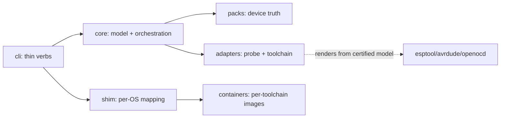

# Architecture Spine — universal-mcu-env

## Design Paradigm

Hexagonal: a vendor-neutral core owns the certified device model and orchestration; hardware packs (device truth), toolchains, and probe backends are adapters. Namespaces: `core/` (model, validation, verbs), `packs/` (frame + family blocks), `adapters/probe/`, `adapters/toolchain/`, `cli/` (thin verbs + shim).



## Invariants & Rules

### AD-1 — Hexagonal core, adapters at the edge [ADOPTED]

- **Binds:** all
- **Prevents:** vendor logic leaking into the core; STM32 becoming the core by accident
- **Rule:** Only `core/` may define shared vocabulary. Packs, toolchains, and probes integrate exclusively as adapters behind port interfaces. A new brand ships an adapter plus pack sections; core diffs are forbidden for brand additions.

### AD-2 — Core owns the device model; adapters render only

- **Binds:** CAP-1, CAP-3, CAP-5
- **Prevents:** per-adapter re-derivation of device facts (the openocd-target / core_0-copy drift class)
- **Rule:** The core validates one canonical device model at pack load, including dispatching family blocks to validators registered by family in `packs/` (registry owned by core; adapters never validate). Adapters receive the certified model and own only tool rendering from it; no adapter parses, guesses, or re-derives device semantics.

### AD-3 — No single flash tool; verbs speak, adapters act

- **Binds:** CAP-3, CAP-5
- **Prevents:** a least-common-denominator flash path; core case-per-tool logic
- **Rule:** The core issues `flash`/`debug` verbs against the model. Per-brand HOW lives in adapters (avrdude, esptool, OpenOCD variants); per-device WHAT lives in packs.

### AD-4 — Pack shape: shared frame plus family blocks

- **Binds:** CAP-1, CAP-4
- **Prevents:** junk-drawer schemas; N incompatible vendor formats
- **Rule:** Every pack carries the shared frame (identity, cores, memory, probe ref, proof ritual). Family-specific needs (fuses, partitions, image lists) live in typed blocks each validated by its owning family; unknown blocks are rejected.

### AD-5 — Hardware pack and run config never merge

- **Binds:** CAP-1, CAP-4
- **Prevents:** invocation concerns polluting device truth (language/probe leaking into packs); silent field-level overrides
- **Rule:** Language, pack reference, probe backend, and output are run config (CLI domain). Exactly one device-description source per invocation: `--mcu-config` XOR individual flags — whole-source replacement, never field-level merge. Shape is derived from pack data, never a parameter.

### AD-6 — Thin CLI verbs

- **Binds:** CAP-1, CAP-2, CAP-3
- **Prevents:** hardware knowledge in a third place (commands), forcing CLI edits per device
- **Rule:** Verbs orchestrate only: load pack → validate model → hand to adapter → render verdict. The adapter interface carries multi-piece results and proof back.

### AD-7 — Single stateless-exec mechanic with cache volumes

- **Binds:** CAP-2, CAP-3
- **Prevents:** container-state drift; dev-container lifecycle management; silent cross-lane cache divergence
- **Rule:** Every verb including `dev` is one stateless container exec; images carry full toolchains; caches persist in named volumes keyed by image digest plus project hash, with ownership and invalidation owned by `core/` (image bump invalidates); the project bind-mounts. Nothing of value lives only in a container.

### AD-8 — Per-toolchain images, language selects

- **Binds:** CAP-2, CAP-3
- **Prevents:** multi-gigabyte fat pulls; coupled toolchain bumps
- **Rule:** One OCI image per toolchain family (`cpp`, `rust`, later `avr`/`esp`). The top-level language flag resolves the image via a lookup interface owned by `core/`; adapters register their images against it (registration, not core edits, keeps AD-1). Identical image serves interactive and transparent modes.

### AD-9 — Probe passthrough owned by the shim

- **Binds:** CAP-3, CAP-5
- **Prevents:** per-OS `/dev` knowledge leaking into core or adapters
- **Rule:** Packs declare connection requirements (VID/PID, serial pattern, or network). The shim maps them per OS and hands core/adapters a prepared endpoint in the core-owned endpoint struct (transport + address, never a bare path string).

### AD-10 — Proof ladder

- **Binds:** CAP-3
- **Prevents:** unverifiable "it flashed" claims; incomparable cross-adapter verdicts
- **Rule:** Run proof prefers automated probe readback, then LED, then manual register inspection as accepted fallback. Each pack declares its rung. Proof results use the core-owned proof struct (rung + evidence payload); adapters must fill every rung they certify comparably.

## Consistency Conventions

| Concern | Convention |
| --- | --- |
| Naming (ids, branches, images) | Tickets `<kind>-<NNN>-<slug>`; branches `ticket/<id>-<slug>`; images `<family>:<toolchain-version>` |
| Data & formats | Pack YAML: shared frame + typed family blocks; origins hex strings, sizes `<n>[K/M/G]`; one device-description source per invocation, whole-source replacement only |
| State & cross-cutting | Ephemeral containers; caches in named volumes; errors carry verb + adapter + proof-attempt; evidence rule governs claims |

## Stack

| Name | Version |
| --- | --- |
| Python (engine + shim) | >= 3.11 |
| uv (dep management) | >= 0.12 (verified 0.12.23) |

## Structural Seed

```text
engine/
  cli/          # thin verbs: create/dev/build/flash/debug + shim
  core/         # device model, validation, orchestration
  packs/        # frame validator + family block validators + 3 STM32 packs
  adapters/
    probe/      # openocd (ST fork), probe-rs, esptool, avrdude, stlink-fallback
    toolchain/  # per-family build defs + image registration against core lookup
```

## Capability → Architecture Map

| Capability / Area | Lives in | Governed by |
| --- | --- | --- |
| CAP-1 create-from-pack | `cli/create` + `core` + `packs/` | AD-4, AD-5, AD-6 |
| CAP-2 interactive-shell | `cli/dev` + shim + images | AD-7, AD-8 |
| CAP-3 transparent-build-flash | `cli` + shim + adapters | AD-2, AD-3, AD-6, AD-7, AD-9, AD-10 |
| CAP-4 user-config | `core` validation + packs | AD-4, AD-5 |
| CAP-5 probe-adapter | `adapters/probe/` | AD-2, AD-3, AD-9 |
| CAP-6 cpp-deps | spike first; `adapters/toolchain/` | AD-1 (mechanism pending spike) |

## Deferred

- Exact pack field lists per family (pack-schema story owns; AVR/ESP blocks draft-until-board-proven).
- Toolchain/probe version pins incl. OCI runtime (pinned per image when images are defined; same story). OpenOCD pins the ST fork/branch, not bare upstream (verified 2026-10-08).
- STM32 toolchain decision: STM32CubeCLT (v1.22.0 verified 2026-10-08) vs vanilla ARM GCC — decided when images are defined.
- C/C++ dep mechanism (spike pending; integration post-V1 unless cheap).
- Image registry choice and multi-language project image resolution.
- Windows native lane; pack validator/generators (post-V1).
- Shim implementation details beyond Python+uv.
